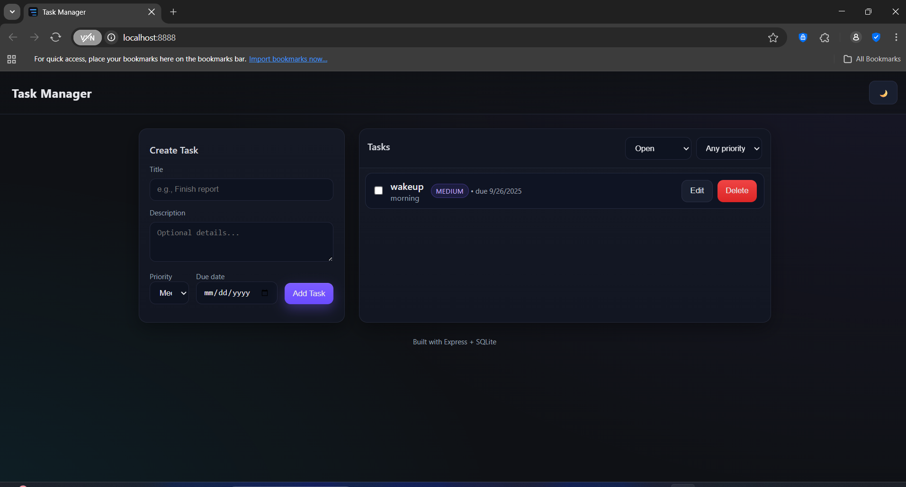

# Multi-Service Application with Docker Compose

This project demonstrates how to deploy a multi-service application using Docker Compose. The application consists of a MongoDB database, a Node.js backend API, and a frontend served by Nginx.

## Table of Contents
- [Architecture Overview](#architecture-overview)
- [Prerequisites](#prerequisites)
- [Local Development Setup](#local-development-setup)
- [Deployment to EC2](#deployment-to-ec2)
- [Testing the Application](#testing-the-application)
- [Troubleshooting](#troubleshooting)

## Architecture Overview

The application consists of three main services:

1. **MongoDB**: Database service for storing application data
2. **Backend**: Node.js API server that handles business logic
3. **Frontend**: Nginx web server serving the frontend UI


## Prerequisites

Before you begin, ensure you have the following installed:

- Docker 
- Docker Compose 
- Git
- AWS Account (for EC2 deployment)


## 1. Local Development Setup

## Application Structure

```text
project/
├── backend/
│   ├── src/
│   ├── models/
│   ├── routes/
│   ├── package.json
│   |── server.js
|   └── Dockerfile
├── frontend/
│   ├── public/
│   ├── nginx.conf
│   ├── package.json
│   └── Dockerfile
├── docker-compose.yml
└── README.md
```

### Docker Compose Configuration

The docker-compose.yml file defines all services:
```
services:
  mongo:
    image: mongo:6
    ports:
      - "27017:27017"  # MongoDB accessible locally
    volumes:
      - mongodata:/data/db  # Persist database data

  backend:
    build: ./backend
    environment:
      - PORT=3000
      - MONGO_URI=mongodb://mongo:27017/tasksdb
    depends_on:
      - mongo

  frontend:
    build: ./frontend
    depends_on:
      - backend
    ports:
      - "8888:80"  # Open the app at http://localhost:8888

volumes:
  mongodata:
```


## 2. Start Docker Desktop
Ensure Docker Desktop is running on your machine

Docker Dashboard


## 3. Build and Start Services

```
docker-compose up --build
```
This command will:

- Build the Docker images for backend and frontend
- Start all services in dependency order
- Display logs in the terminal

Docker Build


Docker Compose Up


## 4. Verify Services are Running

Open a new terminal and run:
```
docker-compose p
```

You should see all three services running:

Docker ps Command


## 5. Access the Application

Open your browser and navigate to:

- Frontend UI: http://localhost:8888
- Backend API: http://localhost:8888/api/tasks (proxied through frontend)
- MongoDB: localhost:27017 (optional direct access)

Application View


## 6. Stop Services

When you're done, stop all services with:

```
docker-compose down
```
Docker compose down


# Deployment to EC2 (Testing)

## 1. Launch an EC2 Instance
- Go to AWS EC2 Console
- Click "Launch Instance"
- Choose Ubuntu Server 22.04 LTS
- Select t2.micro (Free Tier eligible)
- Configure security group with ports:
- SSH (22): Your IP address
- Custom TCP (8888): 0.0.0.0/0
- Custom TCP (27017): Your IP address (optional)
- Launch the instance and connect using SSH

EC2 dashboard


## 2. Install Docker and Docker Compose
```
# Update package index
sudo apt update

# Install prerequisites
sudo apt install -y apt-transport-https ca-certificates curl software-properties-common

# Add Docker's GPG key
curl -fsSL https://download.docker.com/linux/ubuntu/gpg | sudo apt-key add -

# Add Docker repository
sudo add-apt-repository "deb [arch=amd64] https://download.docker.com/linux/ubuntu $(lsb_release -cs) stable"

# Install Docker
sudo apt update
sudo apt install -y docker-ce docker-ce-cli containerd.io

# Add user to docker group
sudo usermod -aG docker $USER

# Install Docker Compose
sudo curl -L "https://github.com/docker/compose/releases/download/1.29.2/docker-compose-$(uname -s)-$(uname -m)" -o /usr/local/bin/docker-compose
sudo chmod +x /usr/local/bin/docker-compose

# Log out and log back in for group changes to take effect
exit
```

## 3. Clone and Run the Application
```
# Clone the repository
git clone https://github.com/yourusername/docker-compose-app.git
cd docker-compose-app

# Start services
docker-compose up -d
```

Git Clone on EC2


Docker Up on EC2


## 4. Verify Services on EC2
```
docker-compose ps
```

Docker ps command (EC2)


## 5. Access the Application
Open your browser and navigate to:

- Frontend UI: http://<ec2-public-ip>:8888
- Backend API: http://<ec2-public-ip>:8888/api/tasks
- MongoDB: <ec2-public-ip>:27017 (if exposed)

Access the Application via EC2

Application Access (EC2)


## Service Details
### MongoDB Service
- Uses official MongoDB 6 image
- Exposes port 27017 to the host
- Uses a named volume for data persistence

### Backend Service
- Built from ./backend directory
- Sets environment variables for port and MongoDB connection
- Depends on MongoDB service
- No host port mapping (internal only)

### Frontend Service
- Built from ./frontend directory
- Depends on backend service
- Maps host port 8888 to container port 80
- Proxies API requests to backend service

## Testing the Application

### 1. Frontend Testing
- Access the frontend at ```http://localhost:8888``` (local) or ```http://<ec2-ip>:8888``` (EC2)
- Verify all UI components render correctly
- Test navigation between pages

### 2. Backend API Testing
- Access the API endpoints through the frontend proxy:
- GET ```http://localhost:8888/api/tasks```
- POST ```http://localhost:8888/api/tasks```
- Verify correct responses and status codes
- Test error handling

### 3. Database Testing
- Verify data persistence by:
- Adding data through the frontend
- Restarting containers
- Confirming data still exists
- Test database connectivity from backend

### 4. Integration Testing
- Test complete user workflows
- Verify data flows correctly between all services
- Test error scenarios

## Troubleshooting
### Common Issues

#### Service Won't Start
- Check logs: ```docker-compose logs [service-name]```
- Verify port conflicts: ```netstat -tlnp | grep :8888```
- Check for syntax errors: ```docker-compose config```

#### Connection Refused
- Verify security group settings (EC2)
- Ensure services are running: ```docker-compose ps```

#### Database Connection Issues
- Verify MongoDB is running: ```docker-compose exec mongo ping```
- Check connection string in backend environment variables
- Test connectivity: ```docker-compose exec backend ping mongo```

#### Build Failures
- Check Dockerfile syntax
- Verify all required files are present
- Check for missing dependencies

## Useful Commands
```
# View all containers
docker-compose ps

# View logs for all services
docker-compose logs

# View logs for specific service
docker-compose logs backend

# Stop all services
docker-compose down

# Stop and remove volumes
docker-compose down -v

# Rebuild and restart
docker-compose up -d --build

# Execute command in container
docker-compose exec backend sh
```


